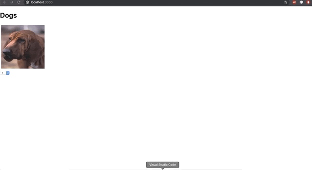

# Props

In Visual Studio code, press `command+shift+v` (Mac) or `ctrl+shift+v` (Windows) to open a Markdown preview.

## Getting Started

Using your command line, you will need to navigate to the this folder, install all dependencies, and start the app.

```bash
cd exercises/05_effect_challenge/
code . # if you would like to open this in a separate VSCode window
yarn install
yarn start
```

If, at any time, you need to stop the app, press `ctrl+c`.

## Reason for the Challenges

As a frontend Engineer, we often have to interact with Apis and understanding the useEffect api will make our job that much easier.

## Challenge 1

As a user, I would like to be greeted with one dog image, and have the ability to add more images using a dropdown.

### Instructions:

1. Create a component named "DogRender".
2. The component will render a dropdown which will dictate the amount of dog images that will be rendered to the screen.


